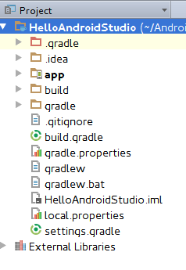

:icons: font
:allow-uri-read:
//caminho padrão para imagens
//:imagesdir: images
:numbered:
:figure-caption: Figura
:doctype: book

//gera apresentacao
//pode se baixar os arquivos e add no diretório
:revealjsdir: https://cdnjs.cloudflare.com/ajax/libs/reveal.js/3.8.0

//Estilo do Sumário
:toc2: 
//após os : insere o texto que deseja ser visível
:toc-title: Sumário
:figure-caption: Figura
//numerar titulos
:numbered:
:source-highlighter: highlightjs
:icons: font
:chapter-label:
:doctype: book
:lang: pt-BR
//3+| mesclar linha tabela

ifdef::env-github[:outfilesuffix: .adoc]

ifdef::env-github,env-browser[]
// Exibe ícones para os blocos como NOTE e IMPORTANT no GitHub
:caution-caption: :fire:
:important-caption: :exclamation:
:note-caption: :paperclip:
:tip-caption: :bulb:
:warning-caption: :warning:
endif::[]

link:https://fagno.github.io/des-movel-i-ifto/[HOME]

= Programação para Dispositivos Móveis I
Fagno Alves Fonseca <fagno.fonseca@ifto.edu.br>
Mestre em Modelagem Computacional de Sistemas – UFT.

== Estrutura do Projeto no Android Studio

A pasta app representa o módulo padrão que é criado no projeto. Nessa pasta temos o código fonte e os arquivos de compilação específicos desse módulo.

Já na raiz do projeto existem os outros arquivos, como por exemplo o build.gradle geral de todo o projeto, que vale para todos os módulos. 

.Estrutura do Projeto
image::../images/est-proj-android-studio.png[] 

app → Pode se criar diversos módulos e o módulo app é o padrão criado pelo Android Studio 

build.gradle → Este arquivo normalmente não é alterado no desenvolvimento, mas é o arquivo de configuração do Gradle e é válido para todo o projeto, incluindo qualquer módulo que você crie.

gradle.properties → Customização do do build do Gradle

gradlew.bat → Script que executa o build do Gradle para compilar o projeto

local.properties → Arquivo de configurações locais do projeto, exemplo o caminho do SDK.

settings.dradle → Arquivo de configuração do Gradle que indica quais módulos serão compilados, você pode escolher, por padrão o app já está listado.

Estrutura de arquivos da pasta app/ só visualizará esse tipo de estrutura se colocar no modo de visualização como Project, o mais adequado é deixar como Android, pois você visualizará só a parte mais usual no desenvolvimento.

.Modo de visualização como Project
 

build → Pasta onde são salvo os arquivos de compilação. A apk por exemplo você encontrará na pasta build/outputs/apk

R.java→ A classe R.java é gerada automaticamente ao compilar e permite que a aplicação acesse qualquer recurso como imagem e arquivos utilizando construir a tela da aplicaçãoas constantes desta classe. Não altere essa classe manualmente.
O R.java é gerado na pasta app/build/generated/source/r.

libs → Pasta para inserir os arquivos .jars que devem ser compilados com o projeto.

src/main/java → Pasta com as classes Java.

src/main/res → Pasta que contém imagens, layouts e arquivos de nternacionalização.

res/drawable → Pasta com as imagens da aplicação uma para cada densidade de tela.

res/mipmap → Pasta com o ícone da aplicação.

res/layout → Pasta que contém os arquivos XML para construira tela da aplicação.

res/menu → Pasta que contém os arquivos XML para construir os menus da aplicação.

res/value → Pasta que contém os arquivos XML para configurações de temas,internacionalização e outras configurações.

== Arquivo AndroidManifest.xml

O arquivo AndroidManifest.xml é a base de uma aplicação Android e contém todas as configurações necessárias para executar a aplicação.

Dentro da tag <manifest> é declarado o pacote principal do projeto, utilizando a tag <package>. Esse é o pacote identificador do projeto e deve ser único no Google Play.

É obrigatório que cada Activity do projeto esteja declarada no arquivo AndroidManifest.xml e para isso utilizamos a tag <activity>, a qual recebe o nome da classe.

A tag <intent-filter> é necessária para definir como a activity será iniciada. A ação MAIN indica que a acticity pode ser iniciada como ponto inicial da aplicação.

Já a categoria LAUNCHER indica que a activity estará disponível para o usuário na tela inicial junto com as outras aplicações instaladas.

Na maioria das vezes, somente uma activity será configurada como o ponto de partida, ou seja, as outras não devem ter esse tipo de configuração.

== Classe MainActivity

A classe MainActivity foi configurada pelo wizard do Android Studio como a activity inicial.

Atualmente o Android Studio cria a classe MainActivity como filha de AppCompatActivity. Ela faz parte da lib de compatibilidade v7 (API Level 7), que permite usar ActionBar em dispositivos com Android 2.1 ou superior.

Na classe Activity, existem o método setContentView(view), responsável por fazer a ligação entre a activity e a view que será responsável por desenhar a interface gráfica da tela.

Para cada tela da aplicação existirá uma activity para controlar seu estado e eventos.

=== Arquivo de layout activity_main.xml

No Android é possível criar o layout da tela em arquivos XML ou utilizar a API Java. Podemos dizer que a activity é o controller do padrão MVC (Model View Controller), e a view é o arquivo XML com o layout.

== Classe R

A Classe R é gerada automaticamente ao compilar o projeto e contém as constantes para acessar os diversos recursos do projeto.

Sempre que um recurso é adicionado no projeto, como por exemplo uma nova imagem, a classe R é gerada automaticamente para conter uma constante para o novo recurso criado. No Android Studio a classe  `R` é gerada na pasta app/build/generated/source/r.

== Arquivo build.gradle

O sistema de build do Android é baseado no Gradle. No projeto existe o arquivo build.gradle padrão de todos os módulos e o arquivo app/build.gradle com as configurações de compilação do módulo app, que é onde fica o código-fonte do aplicativo.

No arquivo app/build.gradle você configura a versão do aplicativo e também a versão mínima do Android (API Level) que seu aplicativo suporta, além de declarar as bibliotecas que são necessárias para a compilação. 

No final do arquivo são declaradas as dependências do projeto. 

Todo aplicativo (apk) deve ser assinado com um certificado digital antes de ser instalado no dispositivo. Por padrão o sistema de build do gradle compila o /projeto no modle debug e release.

O modo debug é utilizado durante o desenvolvimento, e o aplicativo é assinado com o certificado digital de desenvolvimento, o qual é criado automaticamente pelo Android Studio e fica na pasta ~/.android/debug.keystore.

O modo release é utilizado para publicar o aplicativo no Google Play e deve ser assinado com outro certificado, o qual você precisa criar.

== Referências

1. https://developer.android.com/

1. LECHETA, Ricardo R. Google Android: Aprenda a criar aplicações para dispositivos móveis com o Android SDK. 5a ed. – São Paulo: Novatec, 2016.
