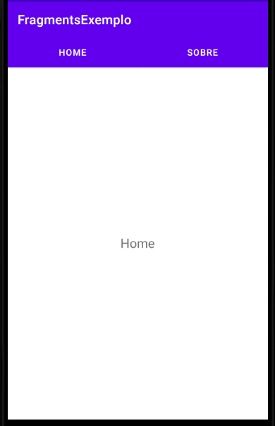

:icons: font
:allow-uri-read:
//caminho padrão para imagens
//:imagesdir: images
:numbered:
:figure-caption: Figura
:doctype: book

//gera apresentacao
//pode se baixar os arquivos e add no diretório
:revealjsdir: https://cdnjs.cloudflare.com/ajax/libs/reveal.js/3.8.0

//Estilo do Sumário
:toc2: 
//após os : insere o texto que deseja ser visível
:toc-title: Sumário
:figure-caption: Figura
//numerar titulos
:numbered:
:source-highlighter: highlightjs
:icons: font
:chapter-label:
:doctype: book
:lang: pt-BR
//3+| mesclar linha tabela

ifdef::env-github[:outfilesuffix: .adoc]

ifdef::env-github,env-browser[]
// Exibe ícones para os blocos como NOTE e IMPORTANT no GitHub
:caution-caption: :fire:
:important-caption: :exclamation:
:note-caption: :paperclip:
:tip-caption: :bulb:
:warning-caption: :warning:
endif::[]

link:https://fagno.github.io/des-movel-i-ifto/[HOME]

= Programação para Dispositivos Móveis I
Fagno Alves Fonseca <fagno.fonseca@ifto.edu.br>
Mestre em Modelagem Computacional de Sistemas – UFT.

== Fragmentos

Um Fragment representa o comportamento ou uma parte da interface do usuário em um FragmentActivity. É possível combinar vários fragmentos em uma única atividade para criar uma IU de vários painéis e reutilizar um fragmento em diversas atividades. Você pode imaginar um fragmento como uma seção modular de uma atividade, que tem o próprio ciclo de vida, recebe os próprios eventos de entrada e que pode ser adicionada ou removida durante a execução da atividade (uma espécie de “subatividade” que pode ser reutilizada em diferentes atividades).

Um fragmento deve sempre ser hospedado em uma atividade e o ciclo de vida dele é diretamente impactado pelo ciclo de vida da atividade do host. Por exemplo, quando a atividade é pausada, todos os fragmentos também são e, quando a atividade é destruída, todos os fragmentos também são. No entanto, enquanto uma atividade estiver em execução (estiver no estado do ciclo de vida retomado), é possível processar cada fragmento independentemente, como adicioná-los ou removê-los. Ao realizar tal transação com fragmentos, também é possível adicioná-los a uma pilha de retorno que é gerenciada pela atividade — cada entrada da pilha de retorno na atividade é um registro da transação de fragmento que ocorreu. A pilha de retorno permite que o usuário reverta uma transação de fragmento (navegue para trás), pressionando o botão Voltar.

.Exemplo com fragments

Figura 1. Duas versões da mesma tela em diferentes tamanhos. À esquerda, uma tela grande contém uma gaveta de navegação controlada pela atividade e uma lista de grade controlada pelo fragmento. À direita, uma tela pequena contém uma barra de navegação inferior controlada pela atividade e uma lista linear controlada pelo fragmento.

Dividir a IU em fragmentos facilita a modificação da aparência da atividade no ambiente de execução. Enquanto sua atividade está no estado de ciclo de vida STARTED ou em um estado mais avançado, os fragmentos podem ser adicionados, substituídos ou removidos.

== Criação de um fragmento

Um fragmento é geralmente usado como parte de uma interface do usuário da atividade e contribui para a atividade com o próprio layout.

Iremos implementar um exemplo utilizando fragmentos conforme figura a seguir. O exemplo implementa dois fragmentos, um que representa a tela HOME e outro a tela SOBRE.

.Exemplo a ser desenvolvido

No arquivo `xml` a seguir, apresentamos o código xml do layout apresentado da figura anterior.

Para criar os fragmentos precisamos criar uma estrutura com `FrameLayout`. É dentro dele que iremos carregar os fragmentos.

.activity_main.xml
[source, xml]
----
<?xml version="1.0" encoding="utf-8"?>
<androidx.constraintlayout.widget.ConstraintLayout xmlns:android="http://schemas.android.com/apk/res/android"
    xmlns:app="http://schemas.android.com/apk/res-auto"
    xmlns:tools="http://schemas.android.com/tools"
    android:layout_width="match_parent"
    android:layout_height="match_parent"
    tools:context=".activity.MainActivity">

    <androidx.constraintlayout.widget.Guideline
        android:id="@+id/guideline3"
        android:layout_width="wrap_content"
        android:layout_height="wrap_content"
        android:orientation="vertical"
        app:layout_constraintGuide_percent="0.5" />

    <Button
        android:id="@+id/buttonHome"
        android:layout_width="206dp"
        android:layout_height="wrap_content"
        android:background="@color/design_default_color_primary"
        android:text="Home" />

    <Button
        android:id="@+id/buttonSobre"
        android:layout_width="206dp"
        android:layout_height="wrap_content"
        android:background="@color/design_default_color_primary"
        android:text="Sobre"
        app:layout_constraintEnd_toEndOf="parent"
        app:layout_constraintHorizontal_bias="0.0"
        app:layout_constraintStart_toStartOf="@+id/guideline3"
        tools:layout_editor_absoluteY="0dp" />

    <FrameLayout
        android:id="@+id/frameExemplo"
        android:layout_width="0dp"
        android:layout_height="0dp"
        android:layout_marginStart="8dp"
        android:layout_marginTop="55dp"
        android:layout_marginEnd="8dp"
        android:layout_marginBottom="8dp"
        app:layout_constraintBottom_toBottomOf="parent"
        app:layout_constraintEnd_toEndOf="parent"
        app:layout_constraintStart_toStartOf="parent"
        app:layout_constraintTop_toTopOf="parent">

    </FrameLayout>

</androidx.constraintlayout.widget.ConstraintLayout>
----

Para criar um fragmento, é preciso criar uma subclasse de Fragment (ou usar uma subclasse existente dele). A classe Fragment tem um código que é muito parecido com o de uma Activity.

A seguir, iremos criar nosso primeiro fragmento, `HomeFragment.java` e o layout `fragment_home.xml`.

Para fornecer um layout para um fragmento, você deve implementar o método de callback onCreateView(), que o sistema Android chama no momento em que o fragmento precisa desenhar o layout. A implementação desse método deve retornar uma View, que é a raiz do layout do fragmento.

Para retornar um layout de onCreateView(), é possível inflá-lo a partir de um recurso de layout definido no XML. Para ajudar a fazer isso, o onCreateView() fornece um objeto LayoutInflater.

Por exemplo, a seguir há uma subclasse de Fragment que carrega um layout do arquivo fragment_home.xml:

.HomeFragment.java
[source, java]
----
...
public class HomeFragment extends Fragment {

    public HomeFragmentEx() {
        // Required empty public constructor
    }

    @Override
    public View onCreateView(LayoutInflater inflater, ViewGroup container, Bundle savedInstanceState) {

        // Inflate the layout for this fragment (converte fragment-home em view para exibir ao usuário)
        return inflater.inflate(R.layout.fragment_home, container, false);

    }
}
----

O parâmetro container passado para onCreateView() é o ViewGroup pai (do layout da atividade) em que o layout do fragmento será inserido. O parâmetro savedInstanceState é um Bundle que fornecerá dados sobre a instância anterior do fragmento se o fragmento estiver sendo retomado (a restauração de estado é abordada em mais detalhes na seção Processamento do ciclo de vida dos fragmentos).

O método inflate() usa três argumentos:

- O código de recurso do layout que você quer inflar.
- O ViewGroup que será pai do layout inflado. Passar o container é importante para que o sistema aplique os parâmetros de layout à exibição raiz do layout inflado, especificado pela exibição pai em que está ocorrendo.
- Um booleano que indica se o layout inflado deve ser anexado a ViewGroup (o segundo parâmetro) durante a inflação. Nesse caso, isso é falso, pois o sistema já está inserindo o layout inflado no container — retornar como verdadeiro criaria um grupo de visualizações redundante no layout final.

No fragmento será apresentado apenas um TextView como exemplo, conforme definido no `fragment_home.xml`.

.fragment_home.xml
[source, xml]
----
<?xml version="1.0" encoding="utf-8"?>
<FrameLayout xmlns:android="http://schemas.android.com/apk/res/android"
    xmlns:tools="http://schemas.android.com/tools"
    android:layout_width="match_parent"
    android:layout_height="match_parent"
    tools:context=".fragment.HomeFragmentEx">

    <TextView
        android:id="@+id/textView1"
        android:layout_width="match_parent"
        android:layout_height="match_parent"
        android:gravity="center_horizontal|center_vertical"
        android:text="Home"
        android:textSize="20sp" />
</FrameLayout>
----

Continuando, iremos criar nosso segundo fragmento, `SobreFragment.java` e o layout `fragment_sobre.xml`, seguindo a mesma estrutura do fragmento anterior. 

.SobreFragment.java
[source, java]
----
...
public class SobreFragment extends Fragment {

    public HomeFragmentEx() {
        // Required empty public constructor
    }

    @Override
    public View onCreateView(LayoutInflater inflater, ViewGroup container, Bundle savedInstanceState) {
        
        // Inflate the layout for this fragment (converte fragment-home em view para exibir ao usuário)
        return inflater.inflate(R.layout.fragment_sobre, container, false);

    }
}
----

.fragment_sobre.xml
[source, xml]
----
<?xml version="1.0" encoding="utf-8"?>
<FrameLayout xmlns:android="http://schemas.android.com/apk/res/android"
    xmlns:tools="http://schemas.android.com/tools"
    android:layout_width="match_parent"
    android:layout_height="match_parent"
    tools:context=".fragment.HomeFragmentEx">

    <TextView
        android:id="@+id/textView1"
        android:layout_width="match_parent"
        android:layout_height="match_parent"
        android:gravity="center_horizontal|center_vertical"
        android:text="Sobre"
        android:textSize="20sp" />
</FrameLayout>
----

Por fim, iremos adicionar os fragmentos a nossa activity. Há duas formas de adicionar um fragmento ao layout da atividade:

- Declarar o fragmento dentro do arquivo de layout da atividade.
- adicionar programaticamente o fragmento a um ViewGroup existente.

No nosso exemplo, iremos adicionar programaticamente.

Para realizar transações de fragmentos na atividade (como adicionar, remover ou substituir um fragmento), você precisa usar APIs de FragmentTransaction. 

Para gerenciar os fragmentos na atividade, você precisa usar FragmentManager. Para adquiri-lo, chame getSupportFragmentManager() na atividade.

Um grande recurso fornecido por fragmentos em atividades é a possibilidade de adicionar, remover, substituir e realizar outras ações com eles em resposta à interação do usuário. Cada conjunto de alterações realizadas na atividade é chamado de transação e cada alteração pode ser feita usando APIs em FragmentTransaction.

Cada transação é um conjunto de alterações que você quer realizar ao mesmo tempo. É possível definir todas as alterações desejadas para uma transação usando métodos como add(), remove() e replace(). Em seguida, para aplicar a transação à atividade, chame commit().

É possível adicionar um fragmento usando o método add(), especificando o fragmento que será adicionado e a visualização em que será inserido, no entanto, iremos utilizar o método replace() porque desejamos substituir o fragmento nas ações de click.

Ao realizar as alterações com FragmentTransaction, é necessário chamar commit() para que as alterações entrem em vigor.

.MainActivity.java
[source, java]
----
...
public class MainActivity extends AppCompatActivity {

    Button buttonHome,buttonSobre;
    HomeFragmentEx homeFragment;
    SobreFragment sobreFragment;

    @Override
    protected void onCreate(Bundle savedInstanceState) {
        super.onCreate(savedInstanceState);
        setContentView(R.layout.activity_main);

        //retirar sombra da ActionBar entre botões do fragments
        getSupportActionBar().setElevation(0);

        buttonHome = findViewById(R.id.buttonHome);
        buttonSobre = findViewById(R.id.buttonSobre);
        homeFragment = new HomeFragmentEx();
        sobreFragment = new SobreFragment();

        FragmentTransaction transaction = getSupportFragmentManager().beginTransaction();
        transaction.replace(R.id.frameExemplo,homeFragment);
        transaction.commit();

        buttonHome.setOnClickListener(new View.OnClickListener() {
            @Override
            public void onClick(View view) {
                FragmentTransaction transaction = getSupportFragmentManager().beginTransaction();
                transaction.replace(R.id.frameExemplo,homeFragment);
                transaction.commit();
            }
        });

        buttonSobre.setOnClickListener(new View.OnClickListener() {
            @Override
            public void onClick(View view) {
                FragmentTransaction transaction = getSupportFragmentManager().beginTransaction();
                transaction.replace(R.id.frameExemplo,sobreFragment);
                transaction.commit();
            }
        });
        
    }
}

----

É importante ler toda a documentação de referência do material, https://developer.android.com/guide/components/fragments?hl=pt-br[neste link].

== Referências

1. https://developer.android.com/guide/components/fragments?hl=pt-br

1. https://developer.android.com/guide/fragments